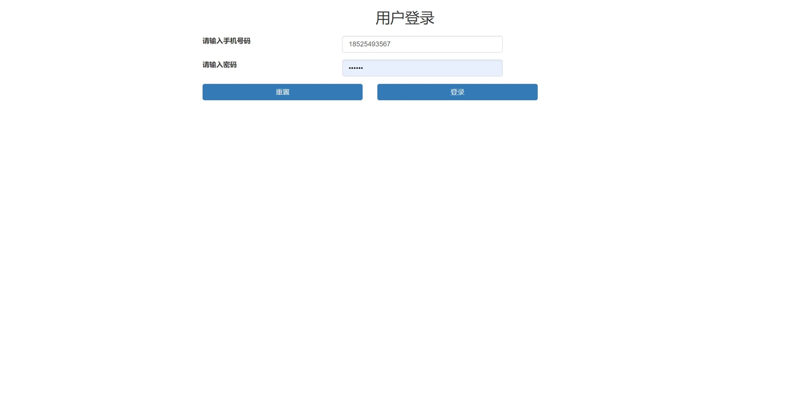
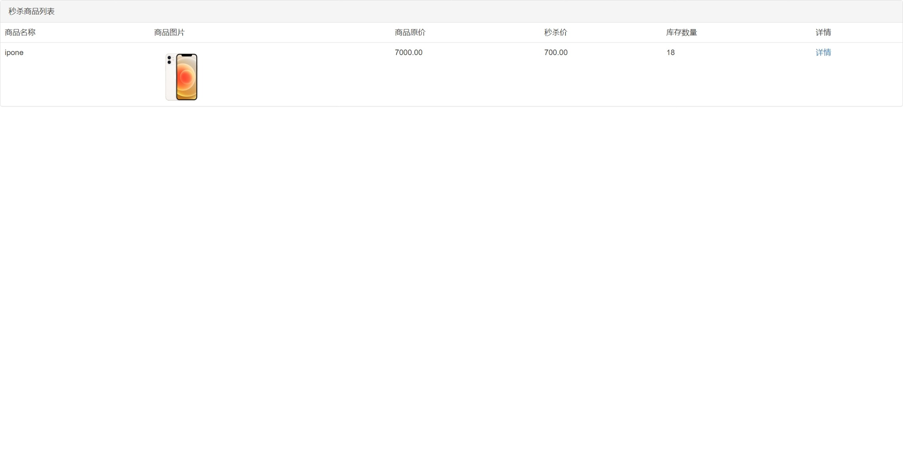
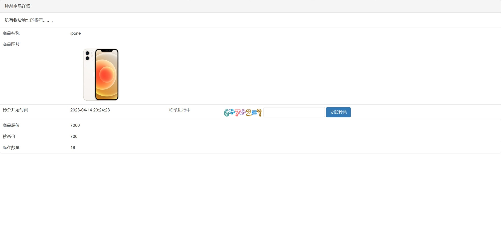
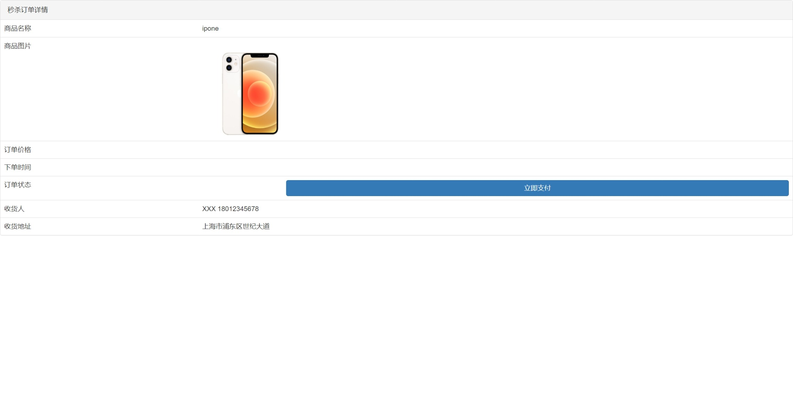

秒杀商城
===============

介绍
-----------------------------------
秒杀，对我们来说，都不是一个陌生的东西。每年的双11,618以及时下流行的直播等等。秒杀然而，这对于我们系统而言是一个巨大的考验。那么，如何才能更好地理解秒杀系统呢？

我觉得作为一个程序员，你首先需要从高维度出发，从整体上思考问题。在我看来，**秒杀其实主要解决两个问题，一个是并发读，一个是并发写**。并发读的核心优化理念是尽量减少用户到服务端来“读”数据，或者让他们读更少的数据；并发写的处理原则也一样，它要求我们在数据库层面独立出来一个库，做特殊的处理。另外，我们还要针对秒杀系统做一些保护，针对意料之外的情况设计兜底方案，以防止最坏的情况发生。

功能模块
-----------------------------------
```
┌─商品列表
├─商品详情
├─秒杀
└─订单详情
```

系统效果
----
##### 登录



##### 商品列表



##### 秒杀页面



##### 订单详情



技术架构
-----------------------------------
#### 开发环境
- 语言：Java 8+ (小于17)
- IDE(JAVA)： IDEA (必须安装lombok插件 )
- 依赖管理：Maven
- 缓存：Redis
- 数据库脚本：MySQL5.7+（其他数据库，[需要自己转](https://my.oschina.net/jeecg/blog/4905722)）

#### 后端
- 基础框架：Spring Boot 2.7.6
- 持久层框架：MybatisPlus 3.4.2
- 数据库连接池：阿里巴巴Druid 1.1.22
- 日志打印：logback
- 消息队列：Rabbitmq
- 其他：Swagger-ui，lombok（简化代码）等。

#### 前端
- Jquery
- Bootstrap
- Thymeleaf


开发环境搭建
----
### JAVA开发环境
- node-v12.16.0-x64.msi
- jdk-8u191-windows-x64.exe
- apache-maven-3.5.4.zip
- mysql-5.7.26-winx64.zip

项目下载和启动相关服务
----

- 拉取项目代码

```
git clone https://github.com/houWenK/Seckill.git
```

- 启动Redit

```
./redis-server redis.conf
```

- 启动Rabbitmq

```
systemctl start rabbitmq-server.service
```

关于作者
----

研究生在读

热爱编程，欢迎大家一起交流学习

邮箱：454305202@qq.com 